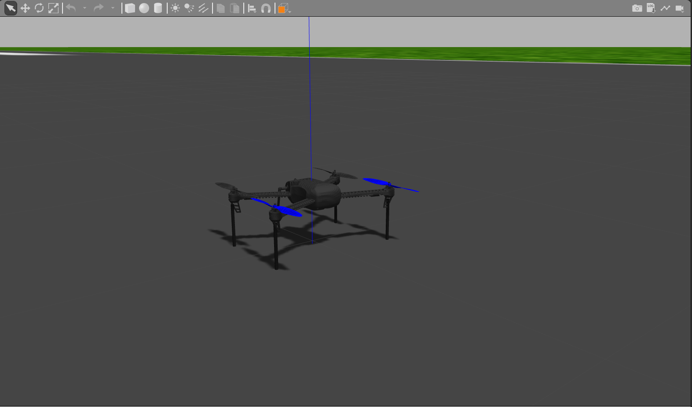
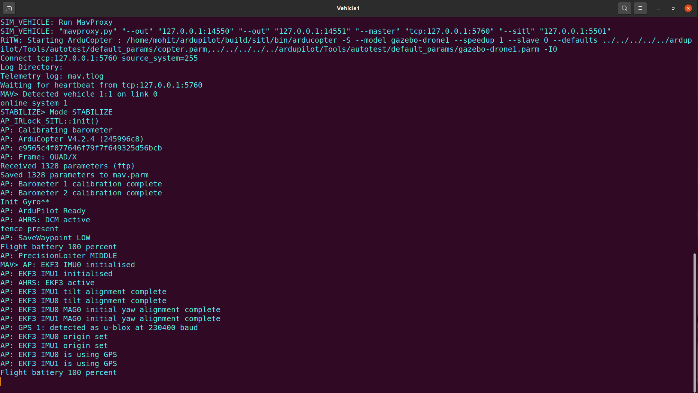

## Setup requirements :    
- ubuntu 20.04 LTS Desktop version
- ros-noetic-desktop-full
- python 3.7+

---
## Setup & Installations 

### 1. Install Ardupilot and MAVProxy for Ubuntu 20.04 :

- Clone ArduPilot in home directory
```
cd ~
sudo apt install git
git clone https://github.com/ArduPilot/ardupilot.git
cd ardupilot
```

- Install dependencies
```
cd ardupilot
Tools/environment_install/install-prereqs-ubuntu.sh -y
```

- Reload profile 
```
. ~/.profile
```

- Checkout Latest Copter Build
```
git checkout Copter-4.2
git submodule update --init --recursive
```

- Run SITL (Software In The Loop) once to set params:
```
cd ~/ardupilot/ArduCopter
sim_vehicle.py -w
```

### 2. Install Gazebo plugin for APM (ArduPilot Master) :
- Clone the the repo in home directory
```
cd ~
git clone https://github.com/khancyr/ardupilot_gazebo.git
cd ardupilot_gazebo
```

- build and install plugin
```
mkdir build
cd build
cmake ..
make -j4
sudo make install
```

- write sourcing command in `.bashrc` file
```
echo 'source /usr/share/gazebo/setup.sh' >> ~/.bashrc
```
- Set paths for models:
```
echo 'export GAZEBO_MODEL_PATH=~/ardupilot_gazebo/models' >> ~/.bashrc
. ~/.bashrc
```
### 3. Setting up the workspace :  
- Create a ROS workspace to run this package in home directory
```
cd
mkdir -p suas_ws/src
cd suas_ws/src
git clone https://github.com/ab31mohit/drone.git
cd ..
catkin_make
```

- Write sourcing command to `.bashrc` file
```
echo "source ~/suas_ws/devel/setup.bash" >> ~/.bashrc
source ~/.bashrc
```

- Copy & paste the contents of `models_drones` folder to `/home/username/.gazebo/models` directory. In case you don't have a *models* folder inside *.gazebo* folder then create one and then paste the contents into that.    

- Copy & paste the contents of `default_params` folder to `home/username/ardupilot/Tools/autotest/default_params` directory.   

- Replace `/home/username/ardupilot/Tools/autotest/pysim/vehicleinfo.py` file with *vehicleinfo.py* (present in this repository) file.

---

## Running the Package : 

- First check if everything is working or not by running following command in the terminal  
```
roslaunch drone drone.launch  
```

It should open the following world in gazebo    
<div align="center">
  
</div>


- Open a new tab of the terminal and run
```
roscd drone_swarming/SITL
bash ./startSITL.sh
```
It should open a new terminal window with SITL. Wait until it shows "GPS is detected" as shown below  
<div align="center">
  
</div>

Now try to control the drone through this sitl using the MAVLINK commands. Run the below commands one by one as shown in the video below.

```
mode guided
arm throttle
takeoff 5
mode land
```

https://github.com/ab31mohit/drone/assets/99829827/6bfa118b-42a6-41cd-b4fa-a815e07d07c0

If the above steps are successfull on your system then setup is done.


